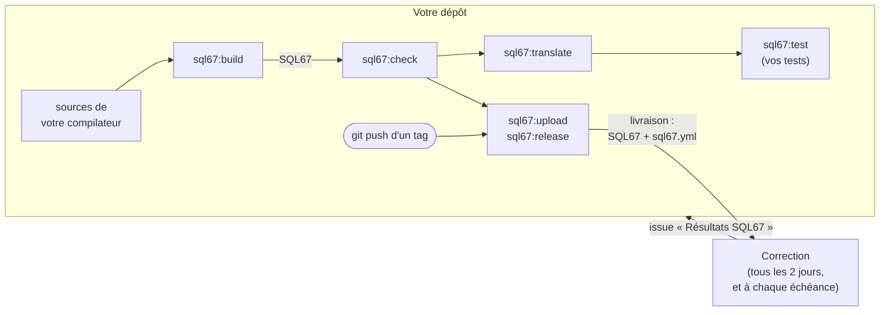
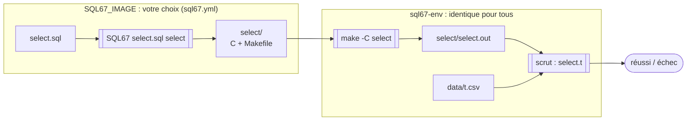
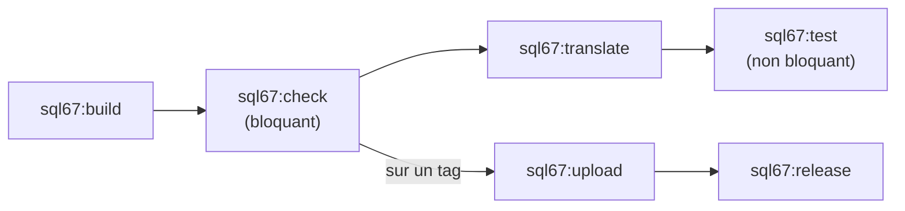

# Livrer votre compilateur : l'exécutable `SQL67`

[[_TOC_]]

## En bref

La correction **ne compile pas vos sources**. Votre pipeline construit un exécutable,
`SQL67`, et le **livre** dans une release. Tous les deux jours, et à chaque échéance, la
correction récupère votre dernière livraison, la fait tourner sur ses tests dans un
environnement identique pour tous les groupes, puis vous envoie les résultats dans une
issue de votre dépôt.



Ce que vous avez à faire :

1. compléter le job `sql67:build` pour qu'il produise `SQL67` ([Compléter le pipeline](#compléter-le-pipeline)) ;
2. si besoin, choisir dans `sql67.yml` l'image où s'exécute `SQL67`, et donc où il est construit ([Où s'exécute quoi](#où-sexécute-quoi)) ;
3. écrire vos tests dans `test/F0/` … `test/F5/` ([Écrire des tests](#écrire-des-tests)) ;
4. livrer en poussant un tag ([Livrer](#livrer)).

## Votre dépôt

```
.
├── .gitlab-ci.yml        le pipeline fourni : à compléter (job sql67:build), jobs sql67:* à ne pas renommer
├── sql67.yml             l'image dans laquelle SQL67 s'exécute (SQL67_IMAGE)
├── README.md, README_ARTEFACT.md
├── …                     les sources de votre compilateur, organisées comme vous voulez
├── SQL67                 produit par sql67:build (ne pas le commiter)
└── test/
    ├── expl/             exemples de la syntaxe des tests (l'un d'eux échoue volontairement)
    ├── F0/               vos tests du fragment F0
    ├── …
    └── F5/
```

## Le contrat de `SQL67`

Pour chaque requête `<nom>.sql`, trois commandes s'enchaînent, toujours lancées depuis le
dossier du fichier :

```sh
SQL67 <nom>.sql <nom>               # 1. votre compilateur : écrit du C et un Makefile dans <nom>/
make -C <nom>                       # 2. compile le C : doit produire <nom>/<nom>.out
<nom>/<nom>.out t1.csv t2.csv …     # 3. le programme obtenu, sur des tables CSV
```

Par exemple, pour `test/F0/select.sql` :

```
test/F0/                          test/F0/
├── select.sql                    ├── select.sql
├── select.t        SQL67 + make  ├── select.t
└── data/          ───────────▶   ├── select/            créé par SQL67
    └── t.csv                     │   ├── *.c, *.h      le C généré
                                  │   ├── Makefile
                                  │   └── select.out    créé par make
                                  └── data/
                                      └── t.csv
```

Règles :

- **`SQL67 <fichier.sql> <dossier>`** écrit dans `<dossier>` (qu'il crée au besoin) des
  fichiers C et un `Makefile`, **même si la requête est invalide**. Dans ce cas, le
  programme produit compile normalement et signale l'erreur **à l'exécution** (message et
  code de retour, précisés dans le sujet). Un échec de `SQL67` ou de `make` compte donc
  toujours comme un défaut de votre compilateur.
- **`make -C <dossier>`** doit produire `<dossier>/<dossier>.out`. Le `Makefile` est libre,
  options de compilation comprises, mais il ne dispose que de **`clang`** (aussi sous les
  noms `cc` et `$(CC)`), **`make`**, la **libc** et la **libm**. `gcc` n'est pas installé.
- **Le `.out`** reçoit les tables en arguments, en nombre quelconque, et les traite **en
  mémoire**. Il ne doit **jamais modifier les CSV reçus**. Certains tests peuvent lui
  demander d'écrire d'autres fichiers.
- Ce qui est comparé : la **sortie standard et la sortie d'erreur** (mêlées), et le **code
  de retour**.

## Où s'exécute quoi

Deux images Docker interviennent :



| Image | Ce qui y tourne | Contenu |
|---|---|---|
| **`SQL67_IMAGE`** | votre `SQL67` uniquement | celle que vous déclarez dans `sql67.yml` ; `sql67-env` par défaut |
| **`sql67-env`** | `make`, les `.out`, scrut | Debian 13 (glibc 2.41), clang, make, libc, libm, scrut ; aucun runtime de langage |

L'adresse de `sql67-env` :

```
gibson-registry.telecomnancy.univ-lorraine.fr/projets/2627/pcl/sql67/template/sujet/sql67-env:latest
```

Le C produit est donc toujours compilé et exécuté dans le même environnement, quel que
soit votre langage. C'est ce qui rend les résultats et le classement de performance
comparables entre groupes.

### Choisir l'image de `SQL67` : `sql67.yml`

Par défaut, `SQL67` s'exécute dans `sql67-env`. S'il a besoin d'un environnement (Python,
Java, Node…), déclarez une image qui le fournit :

```yaml
variables:
  SQL67_IMAGE: "python:3.13-slim"
```

Cette image doit être :

- **publique, sur Docker Hub** (`python:3.13-slim`, `eclipse-temurin:21-jre`,
  `utilisateur/image:tag`…). Les autres registres (`ghcr.io`, `quay.io`, Gibson…) sont
  refusés, à l'exception de `sql67-env` ;
- pour **linux/amd64**, et contenir `/bin/sh` ;
- **suffisante telle quelle** : la correction s'exécute sans réseau, rien ne peut être
  installé au lancement.

`sql67.yml` est inclus par votre `.gitlab-ci.yml` : vos jobs utilisent donc la même image
que la correction. Il est aussi **joint à chaque livraison**, à côté de `SQL67`, et la
correction utilise celui de la livraison évaluée. Une image refusée, ou une livraison sans
`sql67.yml`, donne `sql67-env`, et l'issue de résultats le signale. Ne mettez rien
d'autre dans ce fichier.

### `SQL67` : un exécutable qui tourne dans son image

`SQL67` est **un seul fichier exécutable** (Linux x86_64) qui doit fonctionner dans
`SQL67_IMAGE`, sans réseau ni fichier annexe :

- **avec `sql67-env`**, il doit être **autonome** : binaire natif, ou empaqueté avec tout
  ce dont il a besoin ;
- **avec une image choisie**, il peut s'appuyer sur ce qu'elle contient. Par exemple, un
  script Python (`#!/usr/bin/env python3`) avec `python:3.13-slim`, ou un petit script qui
  lance un `.jar` avec `eclipse-temurin:21-jre`. Ses bibliothèques doivent alors être dans
  l'image ou empaquetées dans `SQL67`.

| Langage | Exécutable autonome (`sql67-env`) | Ou bien, avec une image Docker Hub |
|---|---|---|
| C, C++ | compilation native (`-static` conseillé) | — |
| Rust | `cargo build --release --target x86_64-unknown-linux-musl` | — |
| Go | `CGO_ENABLED=0 go build` | — |
| OCaml | exécutable natif (dune `executable`, `main.exe`) ; le bytecode ne fonctionne pas | — |
| Haskell | GHC natif, `-static -optl-static` si possible | — |
| Java, Kotlin, Scala | GraalVM `native-image` | une image JRE (`eclipse-temurin:21-jre`) |
| Python | PyInstaller ou Nuitka `--onefile` (démarrage plus lent) | `python:3.13-slim` |
| JavaScript, TypeScript | `bun build --compile` | `node:22-slim` |

> [!note]
> **glibc** : un exécutable natif lié dynamiquement doit avoir été construit avec une glibc
> **identique ou plus ancienne** que celle de l'image où il s'exécute. Sinon, il échoue
> avec `version 'GLIBC_2.xx' not found`. Construisez-le dans la même image, ou produisez un
> binaire statique.

Le temps de démarrage de `SQL67` ne compte pas dans le classement de performance, qui ne
mesure que l'exécution des `.out`. Il compte en revanche pour les limites de temps.

## Écrire des tests

Les tests sont des *cram tests* (fichiers `.t`), lancés avec
[scrut](https://facebookincubator.github.io/scrut/). Un test `<nom>` se compose de :

```
test/F0/
├── select.sql      la requête, compilée par le pipeline en select/select.out
├── select.t        ce qu'on attend de select/select.out
└── data/
    └── t.csv       les tables : des fichiers voisins, organisés comme vous voulez
```

La compilation **n'est pas dans le `.t`** : le pipeline la fait avant de lancer scrut. Le
`.t` ne fait qu'exécuter le programme obtenu. Il le retrouve, comme les CSV, grâce à
`$TESTDIR`, le dossier du `.t` :

```
Toute la table :

  $ "$TESTDIR/select/select.out" "$TESTDIR/data/t.csv"
  a,b
  1,2

Une requête invalide compile, mais échoue à l'exécution :

  $ "$TESTDIR/invalid/invalid.out" "$TESTDIR/data/t.csv"
  Error: …
  [2]
```

Syntaxe d'un `.t` :

| Ligne | Signification |
|---|---|
| texte sans indentation | commentaire libre |
| `  $ commande` | une commande (**deux espaces**, `$`, une espace) |
| `  > suite` | suite de la commande précédente (heredoc…) |
| `  texte` | sortie attendue (stdout et stderr), indentée de deux espaces |
| `  [n]` | code de retour attendu, s'il n'est pas 0 |

Chaque `.t` s'exécute dans son propre dossier temporaire, vide. On peut aussi y créer
des CSV à la volée (`cat > t.csv << EOF`, voir `test/expl/setup.t`).

> [!warning]
> Une ligne `$` **non indentée**, ou indentée avec une espace insécable (ce que l'éditeur
> web de GitLab peut insérer), **n'est pas exécutée** : c'est du texte. Le fichier
> « passe » sans rien tester, et n'apparaît pas dans le rapport de scrut. Si un de vos
> tests manque dans l'onglet **Tests** du pipeline, vérifiez son indentation.

Les dossiers `<nom>/` produits par la compilation sont générés : ajoutez-les à votre
`.gitignore`, ou supprimez-les avant de commiter.

## Compléter le pipeline

Le `.gitlab-ci.yml` fourni contient six jobs. **Ne les renommez pas**, et ne renommez pas
le fichier `SQL67` : la correction les cherche par leur nom.



| Job | Quand | Image | Rôle |
|---|---|---|---|
| `sql67:build` | chaque push | `SQL67_BUILD_IMAGE` (`SQL67_IMAGE` par défaut) | construit `SQL67` à la racine du dépôt (artefact, avec `sql67.yml`) |
| `sql67:check` | chaque push | `SQL67_IMAGE` | vérifie que `SQL67` s'exécute dans son image. **Bloquant** : sans lui, pas de livraison |
| `sql67:translate` | chaque push | `SQL67_IMAGE` | `SQL67 <nom>.sql <nom>` pour chaque `.sql` de `test/` |
| `sql67:test` | chaque push | `sql67-env` | `make -C <nom>`, puis `scrut test test/ -r junit > report.xml`. Résultats dans l'onglet **Tests**. Non bloquant |
| `sql67:upload` | sur un tag, si `sql67:check` a réussi | `sql67-env` | dépose `SQL67` et `sql67.yml` dans le registre de paquets du projet |
| `sql67:release` | sur un tag | — | crée la release avec ces deux fichiers : **c'est votre livraison** |

À faire :

1. **Choisir les images.**
   - L'image d'exécution, `SQL67_IMAGE`, se déclare dans `sql67.yml` (voir
     [Où s'exécute quoi](#où-sexécute-quoi)).
   - L'image de construction, `SQL67_BUILD_IMAGE` dans `.gitlab-ci.yml`, est **par défaut
     la même** : `SQL67` est construit là où il s'exécute, ce qui évite les problèmes de
     glibc ou de runtime. Ne la changez que si la construction demande des outils absents
     de l'image d'exécution :

     | Cas | `SQL67_IMAGE` (`sql67.yml`) | `SQL67_BUILD_IMAGE` (`.gitlab-ci.yml`) |
     |---|---|---|
     | C, C++ | `sql67-env` (défaut) | défaut |
     | Python (script) | `python:3.13-slim` | défaut |
     | Rust statique | `sql67-env` (défaut) | `rust:1-trixie` |
     | OCaml natif | `sql67-env` (défaut) | `ocaml/opam:debian-13-ocaml-5.3` |
     | Java (`.jar`) | `eclipse-temurin:21-jre` | `maven:3-eclipse-temurin-21` |

     Une image de construction différente doit avoir une glibc identique ou plus ancienne
     que celle de l'image d'exécution, sauf binaire statique. `sql67-env` et les images
     `…-trixie` utilisent Debian 13.

   Laissez `SQL67_ENV_IMAGE` tel quel.
2. **Compléter `sql67:build`.** Remplacez la ligne `echo "... pas encore complété" && exit 1`
   par vos commandes de construction (des exemples par langage sont en commentaire). Elles
   doivent se terminer par la copie de votre exécutable sous le nom `SQL67`, à la racine.

Au push d'un tag, tous ces jobs tournent à nouveau dans le pipeline du tag : la livraison
est reconstruite et vérifiée à partir du commit tagué.

Vous pouvez ajouter vos propres jobs (tests unitaires, analyse de code…) dans les stages
existants.

## Vérifier en local

Les jobs `sql67:translate` et `sql67:test` font exactement ce que vous feriez dans votre
terminal :

```sh
export PATH="$PWD:$PATH"                         # SQL67 dans le PATH
for sql in $(find test/ -name '*.sql'); do       # SQL → C, puis compilation du C
  (cd "$(dirname "$sql")" && n=$(basename "$sql" .sql) && SQL67 "$n.sql" "$n" && make -C "$n")
done
scrut test test/                                 # rapport lisible
scrut test test/ -r junit > report.xml           # rapport JUnit, comme dans la CI
```

<details>
<summary>Reproduire la correction avec Docker (deux images, sans réseau)</summary>

Remplacez `$SQL67_IMAGE` par votre image, ou par `sql67-env` :

```sh
ENV=gibson-registry.telecomnancy.univ-lorraine.fr/projets/2627/pcl/sql67/template/sujet/sql67-env:latest
docker run --rm --network none -u "$(id -u):$(id -g)" -v "$PWD":/w -w /w --entrypoint sh $SQL67_IMAGE -c \
  'export PATH="$PWD:$PATH"; for sql in $(find test/ -name "*.sql"); do
     (cd "$(dirname "$sql")" && n=$(basename "$sql" .sql) && SQL67 "$n.sql" "$n"); done'
docker run --rm --network none -u "$(id -u):$(id -g)" -v "$PWD":/w -w /w $ENV sh -c \
  'for sql in $(find test/ -name "*.sql"); do make -C "${sql%.sql}"; done; scrut test test/'
```

</details>

## Livrer

Une livraison est une **release**, créée par le pipeline à partir d'un **tag** :

```sh
git tag -a F0-v1 -m "Livraison du fragment F0"
git push origin F0-v1
```

Le pipeline du tag construit `SQL67`, le vérifie (`sql67:check`) et, si la vérification
réussit, crée la release « Livraison F0-v1 ». Un échec de `sql67:test` n'empêche pas de
livrer. Vérifiez ensuite dans **Deploy › Releases** que la release existe, avec ses deux
fichiers, `SQL67` et `sql67.yml`.

- Créez **un nouveau tag pour chaque livraison** (`F0-v2`, `F1-v1`…).
- Ne créez pas la release à la main depuis l'interface : le job `sql67:release` échouerait,
  la release existant déjà.
- La correction prend la release **la plus récemment créée**. À une échéance, elle prend la
  plus récente créée **avant** l'échéance, d'après la date d'enregistrement par GitLab (une
  date modifiée à la main n'est pas prise en compte).
- Sans aucune release, elle se rabat sur l'artefact `SQL67` du dernier pipeline réussi de la
  branche principale. Ne comptez pas dessus : livrez explicitement.

Par exemple, pour une échéance fixée au 19 octobre à 00:00 UTC :

| Release | Créée le (UTC) | Retenue pour l'échéance ? | Retenue au passage suivant ? |
|---|---|---|---|
| `F0-v1` | 17 oct., 18:20 | non, une plus récente existe avant l'échéance | non |
| `F0-v2` | 18 oct., 23:41 | **oui** | non |
| `F0-v3` | 19 oct., 00:12 | non, trop tard | **oui** |

## Ce que fait la correction

Tous les deux jours, et à chaque échéance :

1. elle récupère votre dernière livraison : `SQL67` et `sql67.yml` ;
2. pour chacun de **ses** tests, elle enchaîne le [contrat](#le-contrat-de-sql67) :
   `SQL67` dans votre image, puis `make` et scrut dans `sql67-env` ;
3. elle publie une **issue « Résultats SQL67 »** dans votre dépôt (les précédentes sont
   fermées), et vous recevez une notification par mail.

Pour chaque batterie, l'issue indique les tests réussis et la durée ; pour chaque test,
son nom, son statut et le nombre de cas réussis. Le **contenu des tests n'est jamais
communiqué**.

Pendant la correction, tout s'exécute **sans réseau**, sous un utilisateur non privilégié,
avec des limites de ressources. Votre `SQL67` ne voit que les `.sql`, jamais les CSV ni
les sorties attendues. Limites actuelles :

| Étape | Limite |
|---|---|
| `SQL67` sur un `.sql` | 2 minutes |
| `make` sur un `.sql` | 2 minutes |
| un fichier `.t` | 2 minutes |

Un dépassement compte comme un échec.

| Statut dans l'issue | Signification |
|---|---|
| ✅ réussi | tous les cas du `.t` sont conformes |
| ❌ échec | au moins un cas diffère (sortie ou code de retour) |
| ❌ compilation en échec | `SQL67` ou `make` a échoué sur le `.sql` du test |
| ⏱️ limite de temps dépassée | le test a dépassé sa limite |

## Problèmes fréquents

| Symptôme | Cause et solution |
|---|---|
| `sql67:check` : `version 'GLIBC_2.xx' not found` | `SQL67` a été construit avec une glibc plus récente que celle de `SQL67_IMAGE`. Construisez-le dans la même image, ou en statique |
| `sql67:check` : code 127 alors que `SQL67` existe | il manque l'interpréteur dans `SQL67_IMAGE` (script `#!/usr/bin/env python3` avec l'image par défaut, binaire musl dynamique…). Choisissez une image adaptée dans `sql67.yml` |
| `SQL67_IMAGE doit être une image de Docker Hub` | choisissez une image de Docker Hub, ou `sql67-env` |
| un test absent du rapport, ou qui passe sans rien tester | lignes `$` mal indentées (voir [Écrire des tests](#écrire-des-tests)) |
| `make` : `gcc: not found` | utilisez `$(CC)` ou `clang` dans le Makefile généré |
| dépassement de temps avec PyInstaller | le démarrage est lent : évitez tout travail inutile au lancement |
| la release n'apparaît pas après le tag | `sql67:check` a échoué : la livraison est bloquée. Corrigez, puis poussez un nouveau tag |
